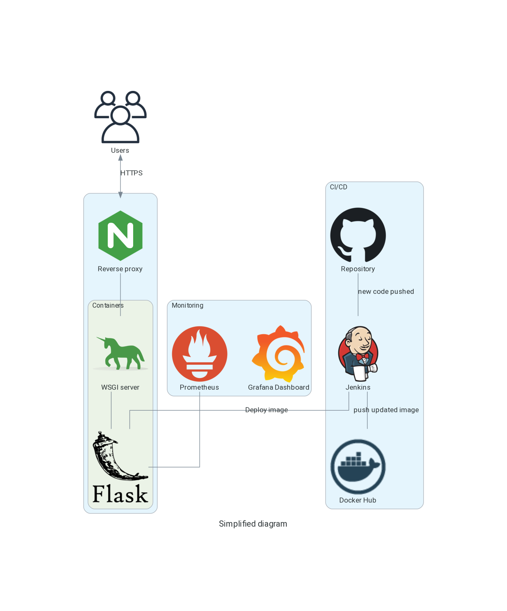
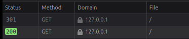
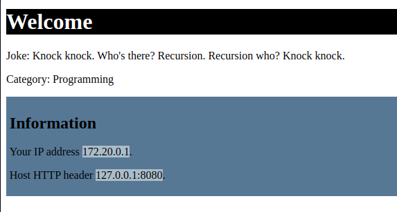
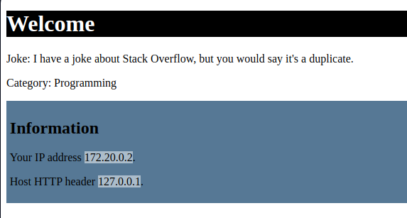
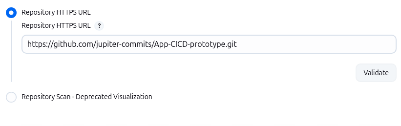
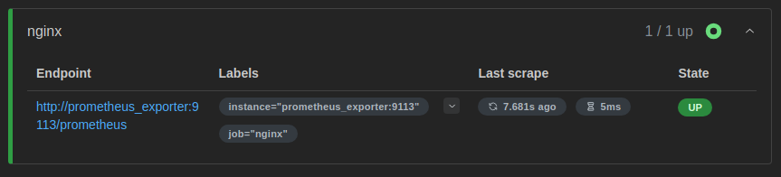
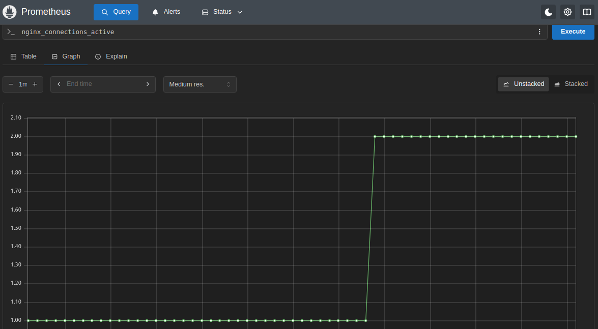
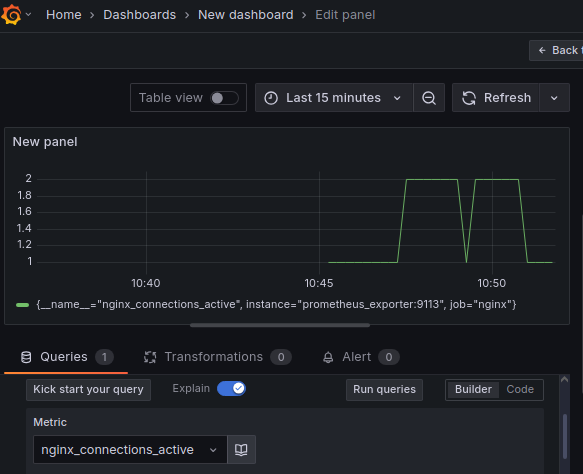

# App-CICD-prototype
Practicing end to end cycle for DevOps

**Project Diagram:**

**Redirecting HTTP to HTTPs:**

**Demo showing container IP address:**

image:
docker.io/jupitercommits/app-cicd-prototype

No one can access the flask app directly (on port 5000) but need to access the WSGI server (Gunicorn) first

security group allows users to request the port of Nginx

This project focuses on each module and integrating them, but to deploy this to a production environment several enhancements are needed:

- Design the underlying architecture itself, for Jenkins, and for the containers to run on multiple hosts or on Kubernetes
- Use multiple replicas of containers to avoid single points of failure
- Attach a domain name, use machines in private subnets with NAT gateway for egress traffic instead of public ones

**What was automated:**

- Containers for the app with Gunicorn and Nginx (using docker and docker-compose)
- Ansible, Terraform, Prometheus

# Screenshots:

Requisting gunicorn before adding nginx:

Requisting nginx:

Redirection to HTTPS:

Configure Jenkins with GitHub repository:

Checking target health on Prometheus:

Query on Prometheus:

Dashboard on Grafana:

